# RL for Chess960

Applying reinforcement learning to Chess960 (Fischer Random Chess) to explore whether an agent trained from scratch on randomised starting positions develops different strategic behaviour compared to classical engines, and whether the absence of opening theory narrows the performance gap.

Chess960 randomises the back rank piece positions across 960 possible configurations, nullifying opening books entirely. Classical engines like Stockfish derive significant advantage from memorised opening theory, so Chess960 levels the playing field theoretically and makes it a more honest test of learned strategic reasoning.

---

## Research Question

> Does an RL agent trained purely from self-play on Chess960 develop emergent strategic behaviour that differs from classical engines? And does the absence of opening theory reduce the performance gap?

---

## Tech Stack

- **Python** — core language
- **python-chess** — chess logic and Chess960 support
- **PyTorch** — neural network and training
- **Stable-Baselines3 / sb3-contrib** — MaskablePPO implementation
- **Gymnasium** — RL environment interface
- **Matplotlib** — training visualisation
- **Wandb** — experiment tracking

---

## Project Structure

```
RL-FOR-Chess960/
├── game/
│   ├── environment.py          # Gym-compatible Chess960 environment
│   └── board_representation.py # Board to tensor conversion (8x8x20)
├── engines/
│   ├── random/                 # Random agent
│   ├── minimax/                # Minimax agent with material evaluation
│   ├── stockfish/              # Stockfish wrapper agent
│   └── rl/                     # PPO-based RL agent, policy network, training
├── evaluation/
│   ├── elo_tracker.py          # Elo rating tracking across agents
│   ├── evaluator.py            # Game-playing evaluation loop
│   ├── training_logger.py      # Per-run training log (JSON)
│   └── plot_training.py        # Training curve visualisation
├── utils/
│   └── action_masks.py         # Legal move masking for MaskablePPO
├── models/                     # Saved model weights and training logs (gitignored)
├── visualisation/              # Training curve graphs (auto-generated)
└── tests/                      # Full test suite
```

---

## Board Representation

The board is encoded as an **8x8x20 tensor**:

- 8x8 for board squares
- Layers 0-5: White pieces (pawn, knight, bishop, rook, queen, king)
- Layers 6-11: Black pieces (same order)
- Layer 12: Turn indicator (1s if it's the agent's move)
- Layers 13-16: Castling rights (W kingside, W queenside, B kingside, B queenside)
- Layer 17: En passant square
- Layer 18: Repetition indicator
- Layer 19: Move count threshold (1s if past move 50)

When the agent plays black, the board is mirrored (vertical flip + piece colour layer swap + castling layer swap) so the agent always sees from its own perspective. This is standard practice for chess RL — see [Improvements in v3](#improvements-in-v3).

## Action Space

Actions follow the AlphaZero-style encoding: **8x8x73 = 4672 discrete actions**, one set of 73 movement planes per from-square:

- Planes 0-55: queen-like moves (8 directions x 7 distances)
- Planes 56-63: knight moves
- Planes 64-72: underpromotions (knight/bishop/rook x 3 capture directions); queen promotion uses the normal queen-move plane

Action masking (via `MaskablePPO`) ensures only legal moves are sampled during training and inference.

---

## Training Curriculum

The agent is trained using a staged curriculum:

1. **Random opponent** — learns basic legal play
2. **Minimax (depth 2)** — learns to avoid simple blunders and take pieces
3. **Stockfish (depth 1)** — learns from a tactically consistent opponent
4. **Self-play** — develops emergent strategy through iterative improvement

Training metrics (ep_rew_mean) and Elo ratings are logged per run and updated automatically.

---

## Improvements in v2

Discovered a large bug present for all of v1 training, where opponent model wasn't loading, meaning self play was actually against the random agent.
Applied fix, and as it gave opportunity to train new agent implemented some architecture improvements.

- **Bug fix** — opponent model loading was failing silently during self-play, meaning v1's "self-play" training.
- **More input planes** — expanded board representation from 8x8x12 to 8x8x20, adding turn indicator, castling rights (4 planes), en passant, repetition, and move count threshold.
- **Fictitious Self-Play** — opponent in self-play sampled 20% of the time from a pool of past snapshots, addressing strategy cycling.
- **PPO hyperparameter tuning** — gamma=0.995 (default 0.99) for long chess games, ent_coef=0.01 (default 0) for explicit exploration regularisation, n_steps=4096 for more samples per update.
- **Draw penalty** — small negative reward (-0.1) for draws to discourage repetition-based stalling.
- **Random colour assignment** — agent trains as both white and black, balanced 50/50.
- **Opponent temperature with decay** — opponent occasionally plays random moves (0.2 → 0.05) to encourage exploration of novel positions during self-play.

---

## Improvements in v3

v2 training plateaued completely: ep_rew_mean vs Minimax stayed flat at ~-0.88 over 8M timesteps with no learning visible. Investigation found two further bugs that the v2 improvements had masked or introduced. v3 addresses these and adds a stronger architecture.

- **Board perspective normalisation** — v2 introduced random colour assignment but the board tensor was always rendered from white's perspective while the action mask used the current player's perspective. The network saw mismatched inputs and couldn't learn consistently. v3 mirrors the board (vertical flip + piece layer swap + castling layer swap) when the agent plays black, so the agent always sees from its own perspective. Standard practice in chess RL.
- **Action mirroring** — paired with the board fix. Actions are translated between network frame (current player's perspective) and real board frame at the env boundary. Keeps all `take_turn()` consistent.
- **Step counter fix** — temperature decay used `self.step_counter` but the counter was never incremented. Temperature was permanently stuck at 0.2, meaning 20% of opponent moves were random across all training. Now decays correctly from 0.2 → 0.05.
- **ResNet architecture** — replaced the 2-layer CNN with a 6-block residual network (~14 layers, 64 channels). Skip connections enable deeper training; padding=1 preserves 8×8 spatial dimensions throughout.

---

## Improvements in v4

v3 showed slow learning improvements and was slow to run, it may have performed well but did not recieve as much training. Improvements in v4 were focused on optimisation and improvements.

- **AlphaZero-style action encoding (8x8x73)** — replaced the 64x64 from/to encoding with 73 movement planes per from-square (direction x distance, knight jumps, underpromotions). Geometrically similar moves now share structure, and underpromotion is expressible for the first time.
- **Spatial policy head** — replaced the dense policy bottleneck (flatten → linear → logits) with a 1x1 convolution producing the 8x8x73 logits directly. Board geometry is preserved all the way to the output and the head has far fewer parameters.
- **Separate spatial value head** — replaced SB3's default single linear value layer with a dedicated 1x1 conv + dense head (AlphaZero-style), giving the value function its own non-linear capacity instead of one dot product over features shared with the policy.
- **Batch normalisation** — added BN throughout the ResNet trunk (Conv → BN → ReLU), stabilising activations through depth.
- **Vectorised training** — 8 parallel environments via `SubprocVecEnv`. Sample collection was the binding constraint (one CPU-bound game at a time); parallel boards give a near-linear throughput improvement.
- **Single `learn()` per phase** — the trainer no longer tears down and reloads the model every 50k steps. Checkpointing, evaluation, and self-play opponent reloading now run through a callback, fixing temperature decay resetting each chunk and deleting a whole class of reload bugs.
- **Claimable draws enforced** — `board.outcome(claim_draw=True)`, so threefold repetition and the fifty-move rule actually end games instead of episodes dragging to fivefold/75-move auto-draws.
- **Loud load failures** — a missing model path now raises `FileNotFoundError` instead of silently continuing with random weights (the failure mode that invalidated v1's self-play).
- **Temperature restricted to self-play** — random opponent moves no longer pollute the Minimax/Stockfish benchmark signal.
- **Misc fixes** — Stockfish process leak in the evaluation loop, dead turn-indicator plane, curriculum threshold mismatch, Minimax alpha-beta pruning with correct checkmate scoring at the horizon.

---

## Training Results

|                  | v1 (baseline)                                                         | v2 (richer planes + FSP)                                              | v3 (bug fixes + ResNet)                                               | v4 (action encoding + spatial heads)                                  |
| ---------------- | --------------------------------------------------------------------- | --------------------------------------------------------------------- | --------------------------------------------------------------------- | --------------------------------------------------------------------- |
| **vs Random**    | 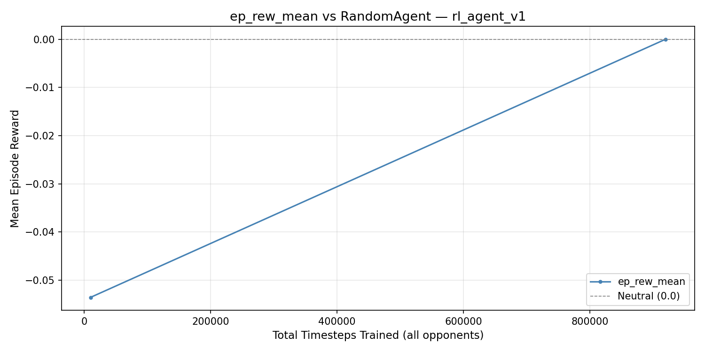    | 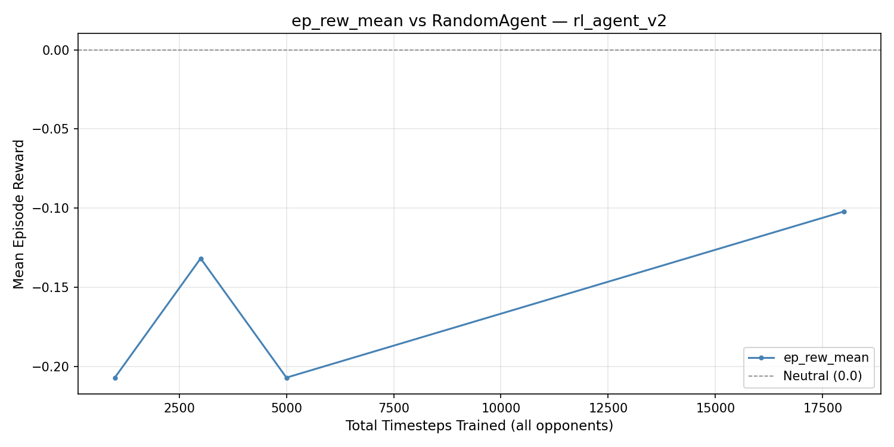    | 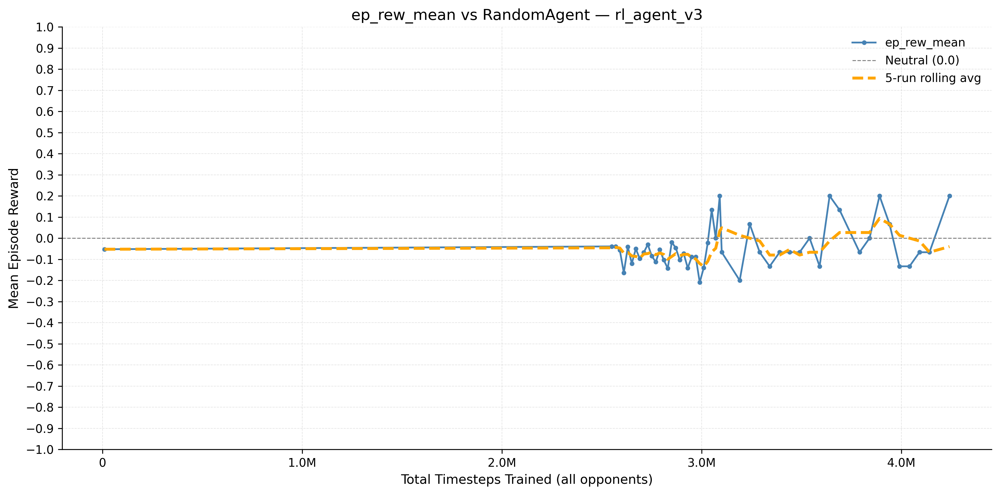    | 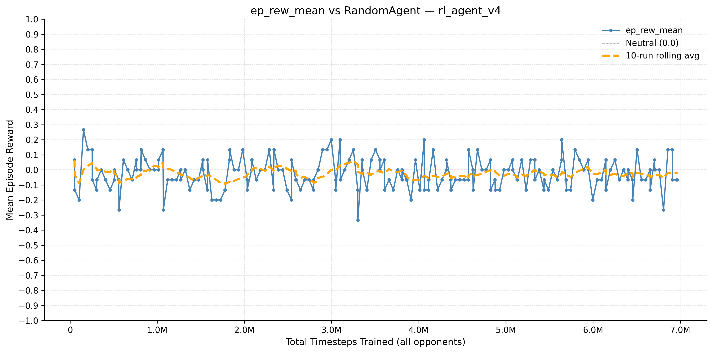    |
| **vs Minimax**   | 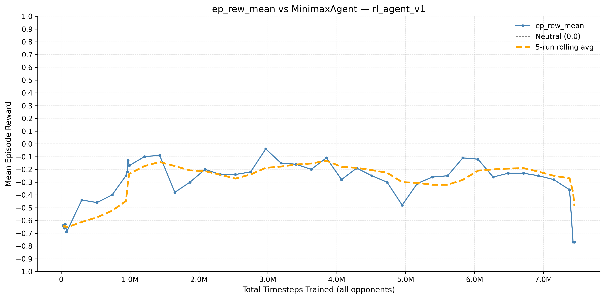   | 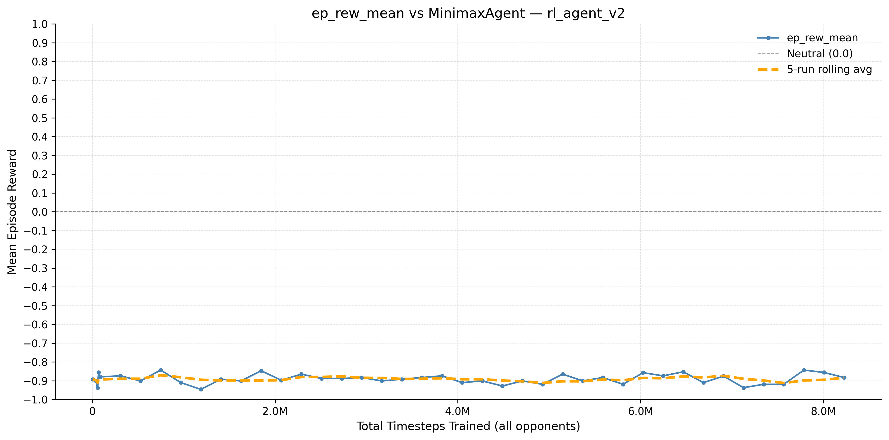   | 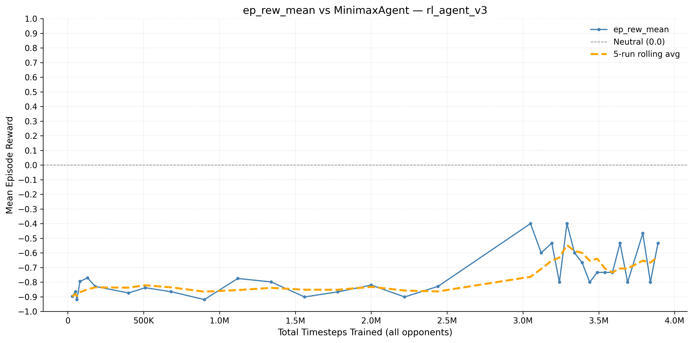   | 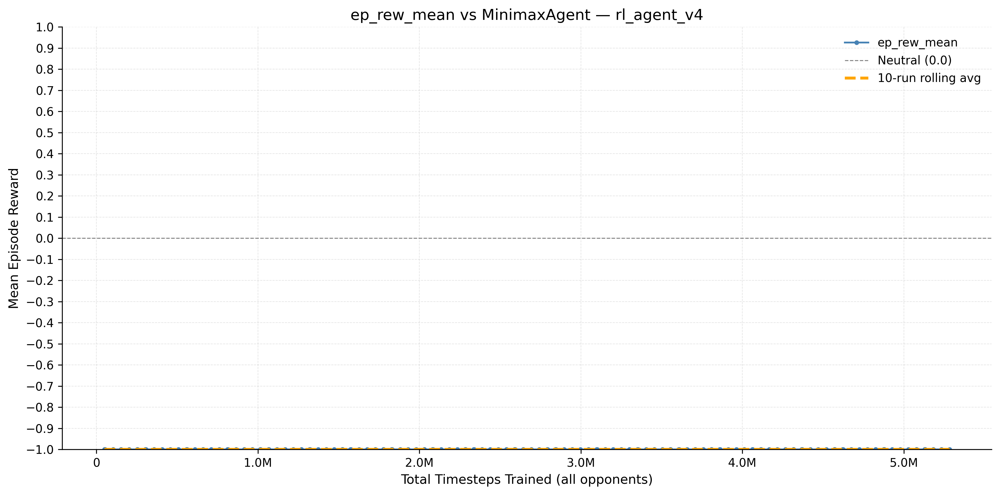   |
| **vs Stockfish** | 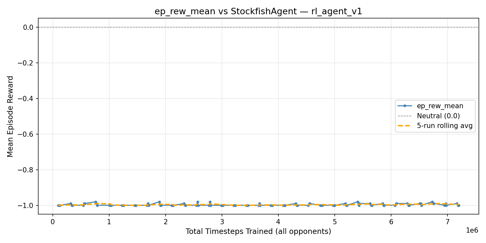 | 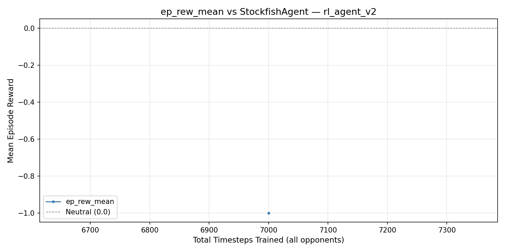 | 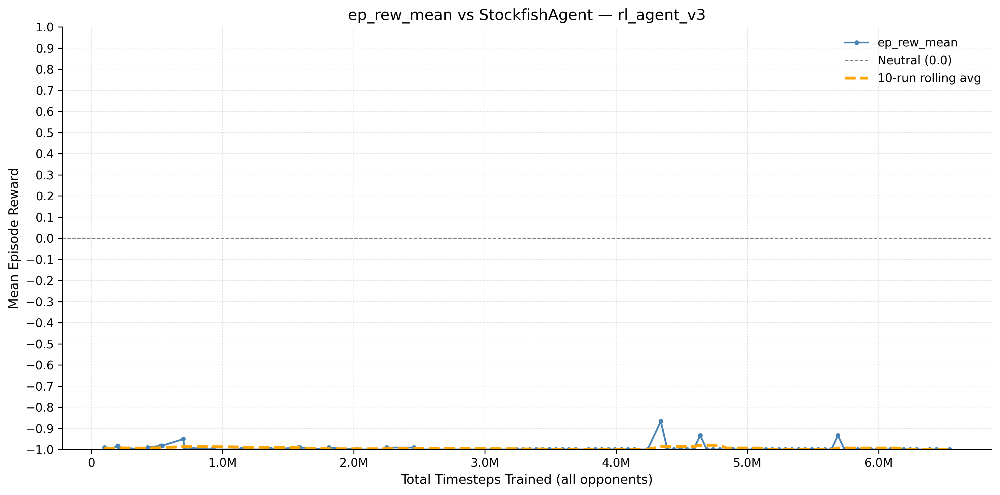 | 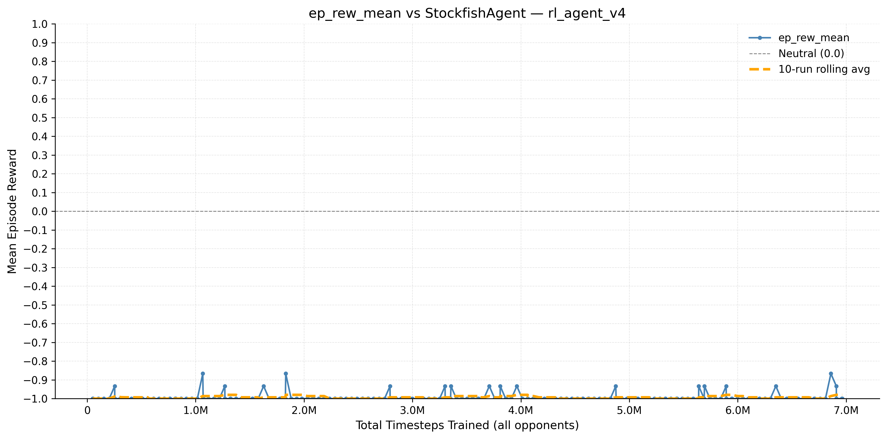 |

_Graphs show mean episode reward over total timesteps trained. Orange line is rolling average. Above 0 = net positive reward._

_Note: ep_rew_mean methodology changed across versions. v1 uses SB3 episode buffer (draw=0). v2 introduced a draw penalty (-0.1) in the reward function, which depresses ep_rew_mean values: the apparent lack of improvement in v2 may partly reflect frequent draws being penalised rather than genuine regression, making v2 harder to evaluate fairly. v3 switches to 15 post-run evaluation games (win=+1, draw=0, loss=-1) from ~3M timesteps. Values are not directly comparable across versions due to this._

---

## Reward Function

- Win: **+1 + (200-move_count)\* 0.001**
- Loss: **-1**
- Draw: **-0.1**
- Illegal move: \*_-1_
- Midgame move: **0**

Reward shaping (e.g. material advantage bonuses) is intentionally omitted to avoid encoding human chess knowledge into the agent. The goal is purely emergent learning.

---

## Design Decisions

**Pure emergent learning vs reward shaping** — chose to avoid encoding chess knowledge (material values, positional heuristics) even though this slows learning.

**Action masking** — used MaskablePPO rather than penalising illegal moves heavily. Illegal moves still get -1, but masking prevents them being sampled in the first place.

**Underpromotion support** — v1-v3 always promoted to queen for simplicity. The v4 action encoding has dedicated underpromotion planes, so the agent can learn when a knight/bishop/rook promotion is better.

**Fictitious Self-Play sampling rate** — 20% past versions, 80% current model. Matches OpenAI Five's Dota 2 default. Higher past-version rates would slow learning but increase diversity.

**Stockfish at depth 1 only** — single difficulty level keeps ep_rew_mean as a clean benchmark metric. Mixed difficulties would mask the actual benchmark with easier wins.

---

## Known Limitations

- **Endgame conversion** — the agent struggles to convert winning endgames, often drawing by repetition due to sparse rewards.
- **Training scale** — significantly below production RL chess systems (AlphaZero used ~56M timesteps on 5,000 TPUs).
- **No MCTS** — inference uses greedy policy sampling rather than Monte Carlo Tree Search, limiting tactical depth at play time.

---

## How to Run

### Install dependencies

```bash
pip install -r requirements.txt
```

### Run tests

```bash
pytest
```

### Train a model

```bash
python -m engines.rl.train
```

### Play a game (outputs PGN for lichess/chess.com analysis)

```bash
python self_play_game_pgn.py
```

### Plot training curves

```bash
python -m evaluation.plot_training --model models/rl_agent_v4
```

---

## Roadmap

### Phase 1 — Environment

- Chess960 Gym-compatible environment, board tensor, reward function, CI

### Phase 2 — Baseline Agents

- Random agent, Minimax agent with material evaluation

### Phase 3 — RL Agent

- MaskablePPO with custom CNN policy, action masking, self-play loop

### Phase 4 — Training and Evaluation

- Elo tracking, Stockfish benchmarking, training curves, per-run logging

### Phase 5 — Interactive Play (planned)

- CLI/GUI interface to play against the trained agent

---

## Potential Future Improvements

- **Reward shaping** — small intermediate rewards for material gain to speed up tactical learning while preserving the emergent learning premise
- **Longer survival reward** — rewarding the agent for surviving more moves to discourage early collapse
- **MCTS at inference** — replacing greedy policy sampling with Monte Carlo Tree Search for stronger play at inference time without retraining
- **Meta-learning** — training a reward function that maximises learning speed rather than hand-designing rewards, inspired by the idea of self-improving reward mechanisms
